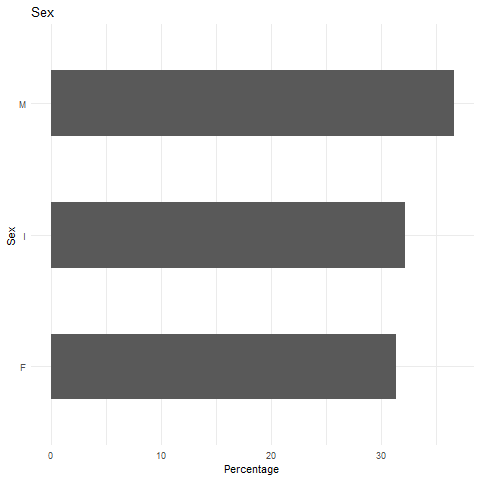
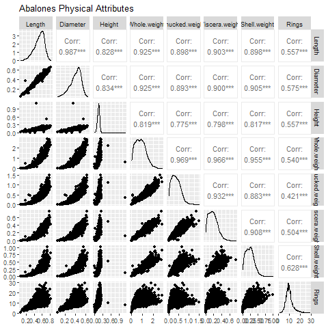
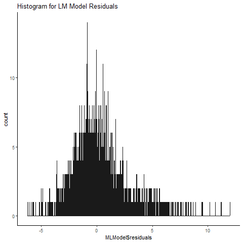
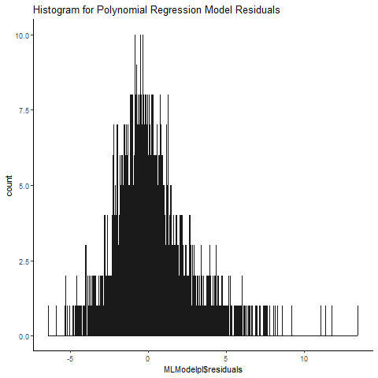
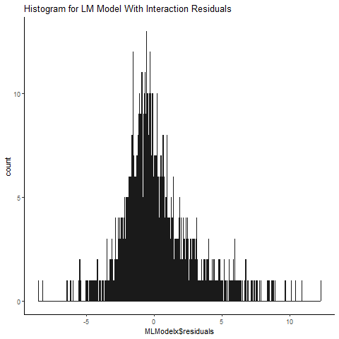
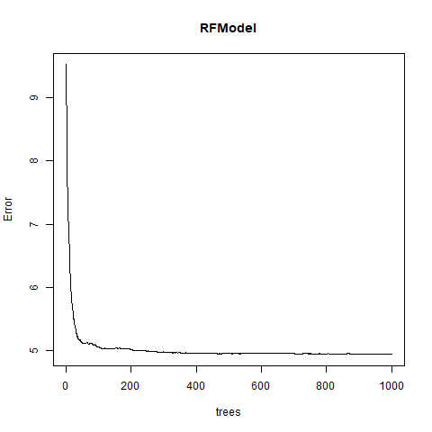
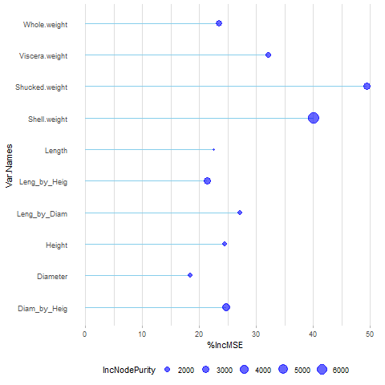
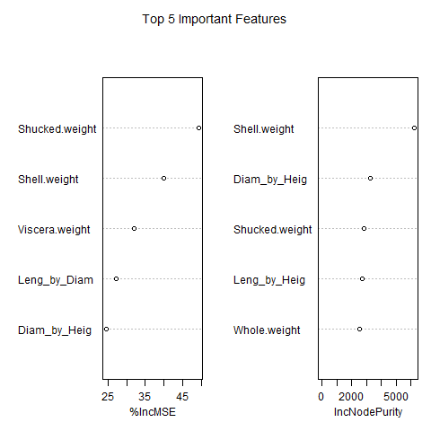
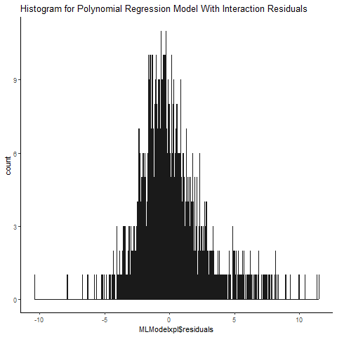

# **Age Prediction for Abalones using Physical Attributes**

### Comparing Multiple Regression and Random Forest for quantitative variable Prediction

This exercise showcased the use of regression models for prediction

This exercise utilised the data from the Abalones Dataset from the Data Science Dojo Repository <https://code.datasciencedojo.com/datasciencedojo/datasets/tree/master/Abalone>

The codes tested and compared various Regression models and Random Forest for this prediction problem.

Analysis were carried out in stages

#### **Data Processing**

This includes:

-   Data exploration variables, and
-   
-   
-   splitting the dataset into training and testing sets.

### Prediction exercise

#### Fitting the Multiple Linear Regression Model - MLModel

-   Assessing the predictive ability of the Multiple Linear Regression model - MLModel

-   Adjusted R-squared: 0.5482

-   Testing the model with test dataset

    -   RMSE 2.281611

    -   R2 0.5161642

-   Checking distribution of Residuals

-   

#### Fitting the Multiple Linear Regression Model with polynomial - MLModelpl

-   Assessing the predictive ability of the model - MLModelpl

-   Adjusted R-squared: 0.5673

-   Testing the model with test dataset

    -   RMSE 2.187928

    -   R2 0.5552416

-   Checking distribution of Residuals

-   

#### Regression Models with interaction

-   Assessing the predictive ability of the model - MLModelx

-   Model used paired interaction between Length, Diameter and Height

-   Adjusted R-squared: 0.5489

-   Testing the model with test dataset

    -   RMSE 2.180328

    -   R2 0.5278718

-   Checking distribution of Residuals

-   

### Can Random Forest do better? Let's find out.

#### Random Forest Model - RFModel

randomForest(formula = Rings \~ ., data = ntraining, ntree = 1000, importance = TRUE)

Type of random forest: regression

Number of trees: 1000

No. of variables tried at each split: 3

Mean of squared residuals: 4.941648

Var explained: 53.43

-   Assessing the predictive ability of the model - RFModel

-   Testing the model with test dataset

    -   RMSE 2.162787

    -   R2 0.5353087

-   Checking Error Rate

-   

#### Random Forest Feature Importance

Variable Important Test results 

#### Regression Models with Polynomial Test with the interactions dataset

-   Assessing the predictive ability of the model - MLModelxpl

-   Model used paired interaction between Length, Diameter and Height

-   Adjusted R-squared: 0.5737

-   Testing the model with test dataset

    -   RMSE 2.125845 0.5514829

    -   R2 0.5514829

-   Checking distribution of Residuals

-   

### Summary

#### Performance with test data

|   Model    |   RMSE   |    R2     |
|:----------:|:--------:|:---------:|
|  MLModel   | 2.272095 | 0.4991430 |
| MLModelpl  | 2.375174 | 0.4715894 |
|  MLModelx  | 2.180328 | 0.5278718 |
|  RFModel   | 2.162787 | 0.5353087 |
| MLModelxpl | 2.125845 | 0.5514829 |

**Model using polynomials and interactions performed the best based on the R2 and RMSE values when test data were introduced.**
